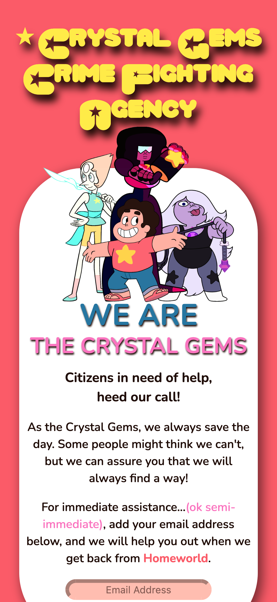
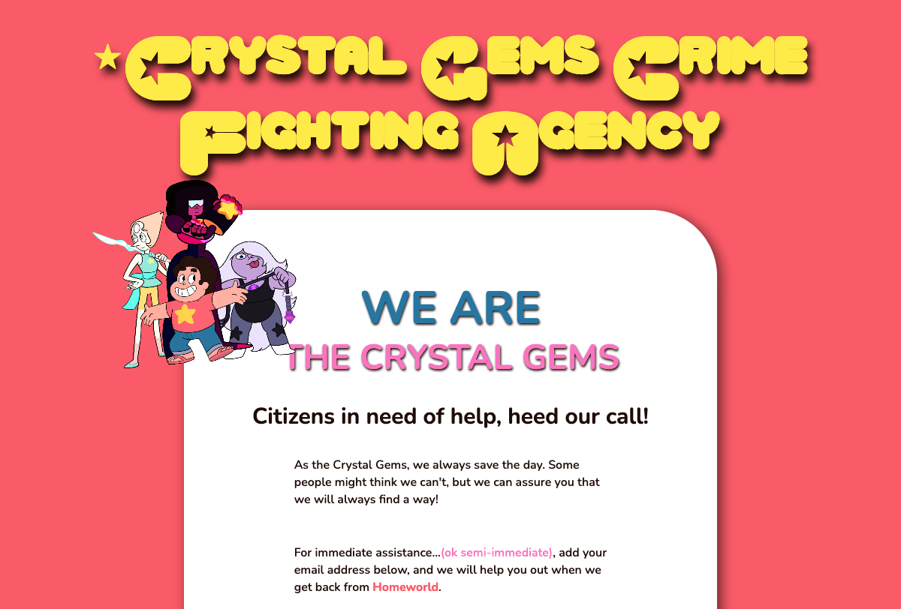

# Crystal Gems Crime Fighting Agency

This is a mock e-mail sign up page for the cartoon Steven Universe. Inspired by the show and needing a bit more practice, I created this project as a way of learning how to manipulate images and custom fonts on different visual breakpoints.

## Table of contents

- [Crystal Gems Crime Fighting Agency](#crystal-gems-crime-fighting-agency)
  - [Table of contents](#table-of-contents)
    - [Screenshots](#screenshots)
    - [Links](#links)
  - [My process](#my-process)
    - [Built with](#built-with)
    - [What I learned](#what-i-learned)
  - [Author](#author)

### Screenshots

### Links

- Solution URL: [Github Repo](https://github.com/ayearicks/CrystalGems)
- Live Site URL: [Live Site](https://yearicks.dev/CrystalGems/index.html)

## My process

### Built with

- HTML5
- CSS custom properties
- Mobile-first workflow
- Visual Studio Code
- Chrome

### What I learned

This project gave me practice with manipulating images for different breakpoints. I also was able to get a bit more of a confidence boost by not using a CSS framework such as Bootstrap on this project.

## Author

- Website - [Ashley Yearicks](https://yearicks.dev)
- Twitter - [@jessarin5](https://www.twitter.com/jessarin5)
